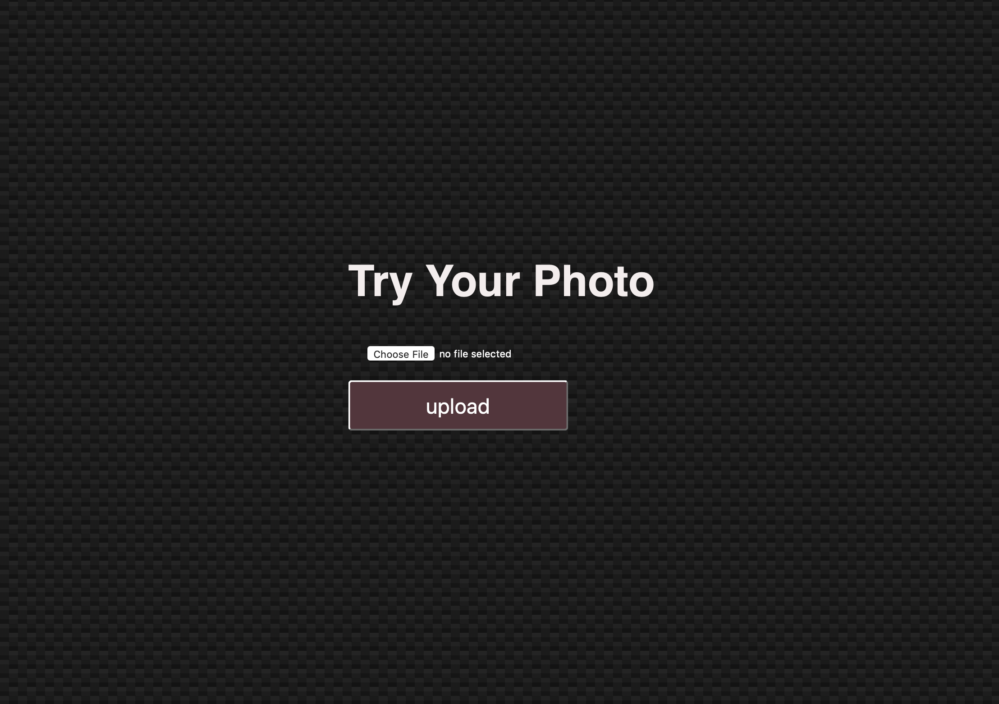

# pytorch-flask-app
Simple app to provide inference with web interface, it will look like



## Todo:
- [x] create flask backend with pytorch prediction
- [x] create simple frontend using html and css
- [ ] dockerize app for deployments


## requirements 
- pytorch>=1.0.0
- torchvision
- flask 
- Pillow

## Run flask server 
- clone this repo
- run the following to launch flask server 
```
FLASK_ENV=development FLASK_APP=app.py flask run
```
- go to `http://127.0.0.1:5000` to see the front page rendered
- upload image you have or you can got to this repo and upload `input.jpg`

## Note:
- to render all the changes you make in the code, use `SHIFT`+reload button on the browser. 


## References :
This app is used for learning purpose and therefore some of the  resources are from : 
- [Pytorch Flask App Tutorial](https://pytorch.org/tutorials/intermediate/flask_rest_api_tutorial.html)
- [Guide to Model deployment](https://heartbeat.fritz.ai/brilliant-beginners-guide-to-model-deployment-133e158f6717)
- [Style CSS background](https://medium.com/@luclemo/styling-background-images-with-css-d9f44cb10a32)